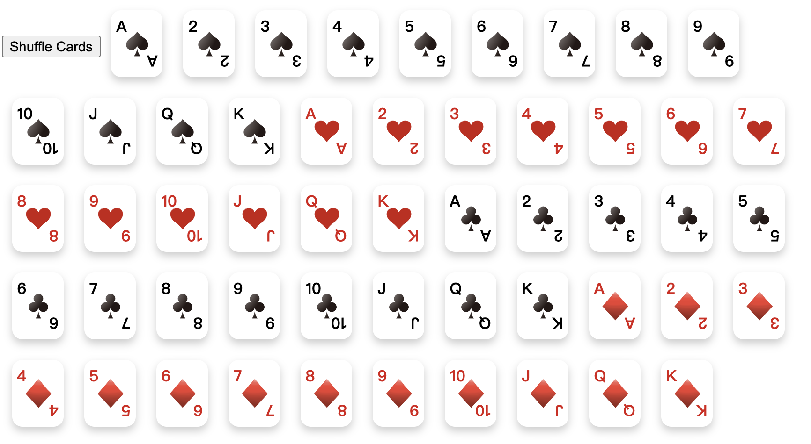
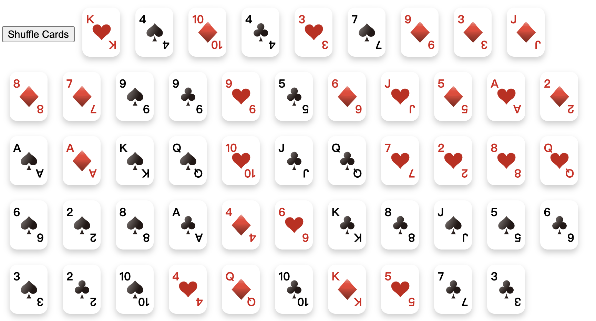

# PokerCard-React

A frontend demo of Poker Cards based on `react`.

## Display



Shuffle:



Hover:


## Install

1、Download Dependency

Dependency for React: `node.js`, `npm`.

2、Clone the Repository

```shell
git clone https://github.com/Y-aang/PokerCard-Demo.git
cd PokerCard-Demo
```

3、Install Package

```shell
npm install
```

3、Run the Rroject

```shell
npm start
```

